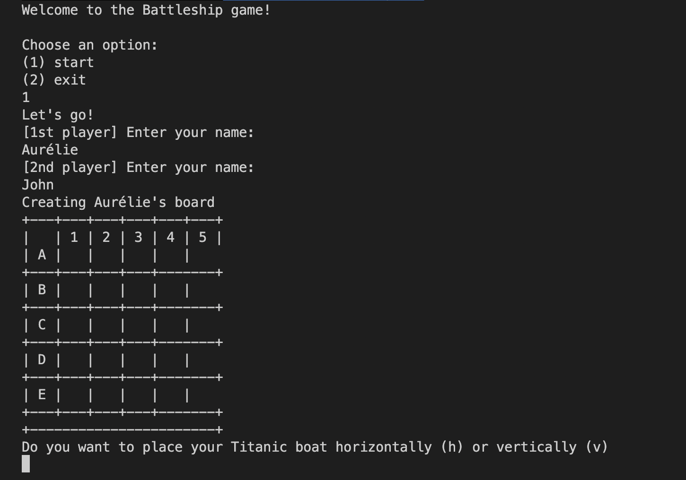

# Battleship Game

This is a terminal mode of Battleship game

- Ruby version: 3.0
- Install dependencies: `$ bundle install`
- Start the program: `$ ruby main.rb`

## Rules

### Options

Two options:
- start the game
- quit the game

### Players

The game is played with 2 players.
The only information requested is the first name.

### Grid

The game is played on 5x5 grids (one per player)
Columns a represented with numbers (1 to 5)
Rows a represented with caracters (A to E)

The gem 'terminal-table' is used to generate graphically a grid

### Ships

Each player must put two ships on the grid.

One ship is called 'Submarine' and it's size is 2x1
The other ship is called 'Titanic' and it's size is 3x1

A ship can't be placed out of bounds nor on the same space as another ship.

### Shots

Players take turns to shoot at the opponent’s grid one after the other.
Each shot receives a Hit (represented by a 'X' on the grid), Miss (represented by a 'O' on the grid) or Sink response

### Winner

The winner is the player who sinks all of their opponent' ships first

## Improvements

- pass a grid size as option
- add obstacles on grid
- allow a single player mode (play against the maching)
- provide an optional level that defines the complexity of the grid
- show winner scores (by stocking in txt file each winner score)